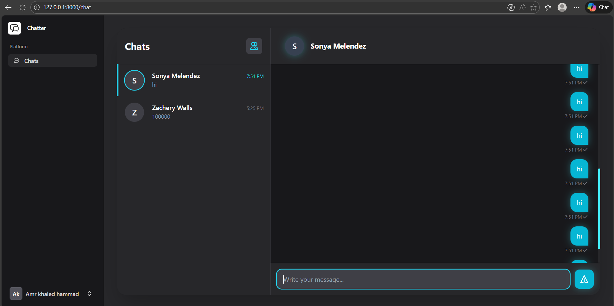
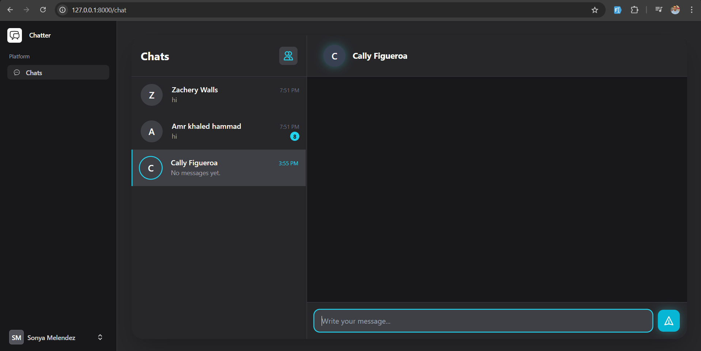
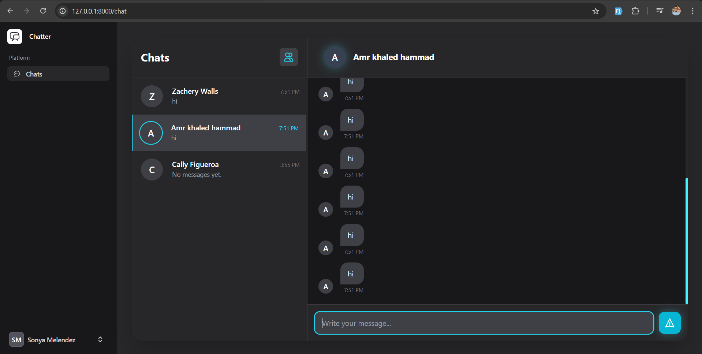

Real-Time Chat 

This project showcases a fully functional real-time chat system built with Laravel Reverb, allowing users to send and receive messages instantly without refreshing the page.

🚀 Features

Real-time messaging (WebSockets)

Private channels for secure communication

Message read/unread tracking

Typing indicators

Online/offline presence

Modern UI

🛠️ Tech Stack

Laravel 11

Laravel Reverb (WebSockets)

Laravel Echo

Livewire / Blade

Redis (optional)

## 📸 Screenshots

### Chat Interface

### Chat Sidebar

### Real-Time Messages

