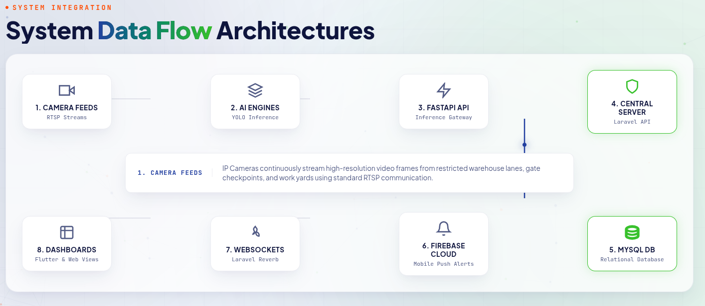
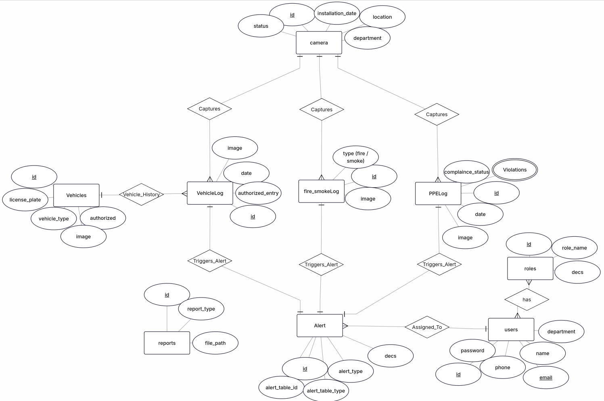
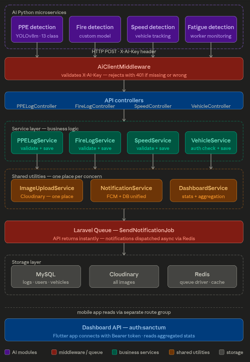

# 🏭 Factory Safety System

An intelligent factory safety monitoring system powered by AI cameras that detect violations in real time — missing personal protective equipment (PPE), unauthorized vehicles, fire/smoke, and speed violations inside the factory — and instantly alert administrators while logging every event for review and reporting.

---

## 💡 Project Idea

Factories face daily risks that are hard to monitor manually around the clock: workers without protective equipment, unauthorized vehicles entering restricted areas, fires that go unnoticed early on, or dangerous speeding inside the facility.

**Factory Safety** solves this by:

1. Connecting a network of cameras to AI detection models that analyze video feeds in real time.
2. When a model detects a violation (PPE / unauthorized vehicle / fire / speed violation), it sends the data to the Backend server.
3. The Backend logs the event, sends an **instant notification (real-time + push notification)** to administrators, and provides a **dashboard** to review all events, reports, and statistics.

This turns the cameras from simple video recorders into an early-warning system with real documentation of violations.

---

## ⚙️ What I Built on the Backend

The Backend is built with **Laravel 12** and acts as the brain of the whole system. Here's what I worked on:

### 1. Architecture Design (Layered Architecture)
- Split Controllers into `Api/`, `Web/`, and `Admin/` so each interface (API for mobile/cameras, Web for the dashboard) is handled independently.
- A separate **Services** layer to isolate business logic from controllers:
  - `VehicleDetectionService` – logic for recognizing authorized/unauthorized vehicles.
  - `PPELogServices` – handling PPE (personal protective equipment) violations.
  - `FireLogService` – logging fire/smoke incidents.
  - `SpeedViolationService` – logging speed violations.
  - `DashboardService` – aggregating real-time statistics (daily incident counts, latest alerts...).
  - `ReportService` – generating reports.
  - `FcmService` – sending push notifications via Firebase.

### 2. Database Design
Designed the migrations and relationships between the core tables:
`users`, `workers`, `cameras`, `vehicles`, `authorized_vehicles`, `vehicle_logs`, `ppes`, `ppe_logs`, `speed_violations`, `fire_logs`, `reports`, `notifications`, `fcm_tokens`.

Each violation type has its own Model and Log, linked to the Camera that captured the event through `belongsTo` relationships, while notifications are linked to multiple log types via **polymorphic relations** (`morphMany`).

### 3. Core Feature: AI Integration
This is the most important technical part of the backend. I built a custom **`AiClientMiddleware`** that validates a secret key (`X-AI-Key`) header before allowing the AI system to submit data, ensuring only the authorized detection system can log events. These endpoints receive detection results directly from the AI models:

```
POST /api/ppe-log       → Log a PPE violation
POST /api/vehicle-log   → Log a vehicle entry (authorized/unauthorized)
POST /api/fire-log      → Log a fire or smoke detection
```

Every request is validated through dedicated **Form Requests**, then passed to the appropriate Service, which uploads the image, creates the log entry, and triggers the notification.

### 4. Real-time Notifications
- **Events + Broadcasting**: events like `PEEDetected` and `UnauthorizedVehicleDetected` are broadcast instantly on **private channels** scoped to each admin.
- **Laravel Reverb** (WebSocket server) so alerts appear live on the dashboard without a page refresh.
- **Firebase Cloud Messaging (FCM)** for sending push notifications to mobile devices.
- **Queued Jobs** (`SendNotificationJob`) so notifications are sent asynchronously without slowing down the API response.

### 5. Authentication & Authorization
- **Laravel Sanctum** for API authentication.
- **Google login** via Socialite.
- Custom middleware (`AdminMiddleware`, `WebAdminMiddleware`, `WebUserMiddleware`) to control access based on user role (Admin / User).

### 6. Other Features
- Image upload and storage via **Cloudinary**.
- Periodic incident/violation report generation.
- Auto-generated API documentation via **Scramble**.
- Request and performance monitoring during development via **Laravel Telescope**.

---

## 🧱 Project Structure



---

## 🔗 Database Design (ERD)



---

## 🤖 AI Integration



---

## 🎥 Demo Video
<!-- [![Demo Video]](public/Screen Recording 2026-07-08 at 12.06.12 PM.mp4) -->
https://drive.google.com/file/d/1OUOvRtvCVsYvzV0ETIdw8bL8661jzit0/view?usp=drive_link


--- 

## 🛠️ Tech Stack

| Category | Technology |
|---|---|
| Framework | Laravel 12 |
| Auth | Laravel Sanctum |
| Real-time | Laravel Reverb (WebSockets), Broadcasting Events |
| Notifications | Firebase Cloud Messaging (FCM) |
| Storage | Cloudinary |
| Frontend (Dashboard) | Livewire |
| API Docs | Scramble |
| Monitoring | Laravel Telescope |
| Queue | Laravel Queues / Jobs |

---

## 📌 Note

This project is still under active development, and new features and improvements are being added continuously.
 
